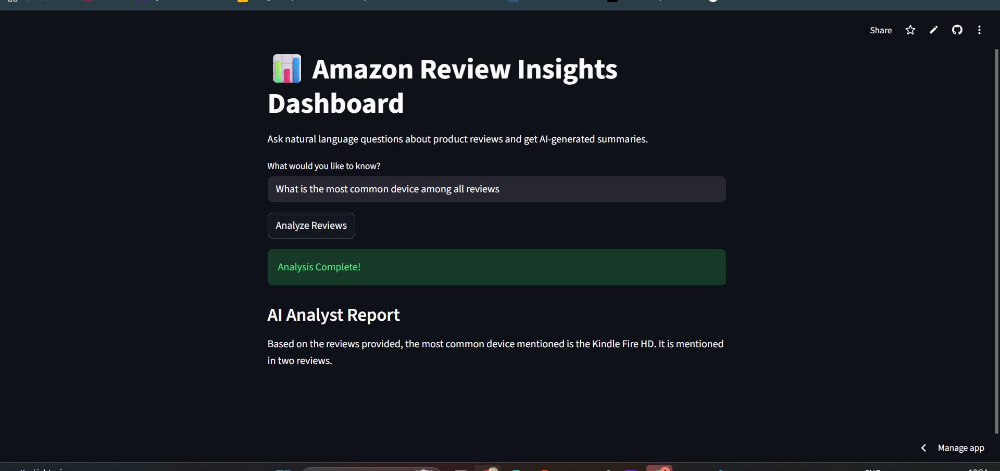

# 📊 Amazon Review Insights: End-to-End RAG Pipeline


## 📖 Overview
The **Amazon Review Insights Dashboard** is a production-ready Retrieval-Augmented Generation (RAG) system. It allows users to ask natural language questions about Amazon product reviews and receive synthesized, AI-generated summaries based strictly on the retrieved data. 

This project demonstrates the complete lifecycle of an AI engineering task: from raw data ingestion and vectorization to containerized microservices and live cloud deployment.

---

## 🏗️ Architecture & Tech Stack

This project is built using a decoupled microservice architecture:

* **Frontend UI:** Streamlit (Hosted on Streamlit Community Cloud)
* **Backend API:** FastAPI (Hosted on Render)
* **Vector Database:** ChromaDB (Persistent SQLite implementation)
* **Embeddings:** Hugging Face Inference API (`sentence-transformers/all-MiniLM-L6-v2`)
* **LLM Orchestration:** LangChain
* **Inference Engine:** Groq (Llama 3)
* **Containerization:** Docker & Docker Compose

> 
---

## ⚙️ The Engineering Journey: Challenges & Solutions

Building a local prototype is easy; deploying it to the cloud is where real engineering happens. Here are the key technical hurdles overcome during development:

### 1. The Containerization OS Conflict (Docker Exit Code 1)
* **Problem:** Building the backend using a lightweight `python:3.10-slim` image resulted in `exit code: 1` during `pip install`.
* **Root Cause:** Heavy ML packages (like `chromadb` and `sentence-transformers`) rely on core C++ math engines. The `slim` Linux image strips out C++ compilers (`gcc`/`g++`) to save space.
* **Solution:** Pivoted the backend Dockerfile to the full `python:3.10` image to ensure all necessary build tools were present, while safely keeping the frontend on the `slim` image.

### 2. Docker Internal Networking 
* **Problem:** The Streamlit frontend could not reach the FastAPI backend, throwing `Failed to connect` errors despite both running locally.
* **Root Cause:** In containerized environments, `localhost` refers to the *inside* of that specific container, not the host machine.
* **Solution:** Leveraged Docker Compose Service Discovery, dynamically routing the frontend POST requests to `http://backend:8000`.

### 3. The Cloud Memory Wall (Render OOM 512MB Limit)
* **Problem:** Upon initial cloud deployment, the Render server crashed with `Out of memory (used over 512Mi)`.
* **Root Cause:** Loading the `sentence-transformers` embedding model directly into PyTorch requires >1GB of RAM, immediately breaching the free-tier cloud limits.
* **Solution:** **Compute Offloading.** Stripped PyTorch from the requirements and refactored the embedding logic to use the `HuggingFaceEndpointEmbeddings`. This shifted the heavy matrix multiplication to Hugging Face's servers, dropping our API RAM footprint to ~150MB.

### 4. Navigating API Deprecations & Auth Scopes
* **Problem:** Langchain threw a severe `JSONDecodeError` because Hugging Face was returning HTML instead of JSON.
* **Root Cause:** Two-fold issue: Hugging Face deprecated the legacy Inference API class, and overhauled their token security scopes, defaulting new tokens to read-only.
* **Solution:** Upgraded the dependency to the official `langchain-huggingface` package and generated a fine-grained HF token with explicit permissions for `Make calls to the Serverless Inference API`.

### 5. Managing Large Data in Version Control
* **Problem:** Pushing the repository to GitHub failed due to the 100MB file size limit on the raw `.csv` review data.
* **Solution:** Optimized `.gitignore` to block raw data (`data/*.csv`) while permitting the compiled, highly compressed `chroma_db` folder. This ensured the live API had access to the vector space without bloating the repository.

---

## 🚀 Live Demo

* **Frontend Dashboard:** (https://amazon-review-insights-rag-fouggcoacsb3n32zimgtez.streamlit.app/)
* **Backend API Docs:** https://dashboard.render.com/web/srv-d7th02pkh4rs73anm2mg/events/docs

---

## 💻 Local Setup & Installation

Want to run this locally? Ensure you have Docker and Docker Compose installed.

**1. Clone the repository**
```bash
git clone [https://github.com/YOUR_USERNAME/amazon-review-insights-rag.git](https://github.com/YOUR_USERNAME/amazon-review-insights-rag.git)
cd amazon-review-insights-rag